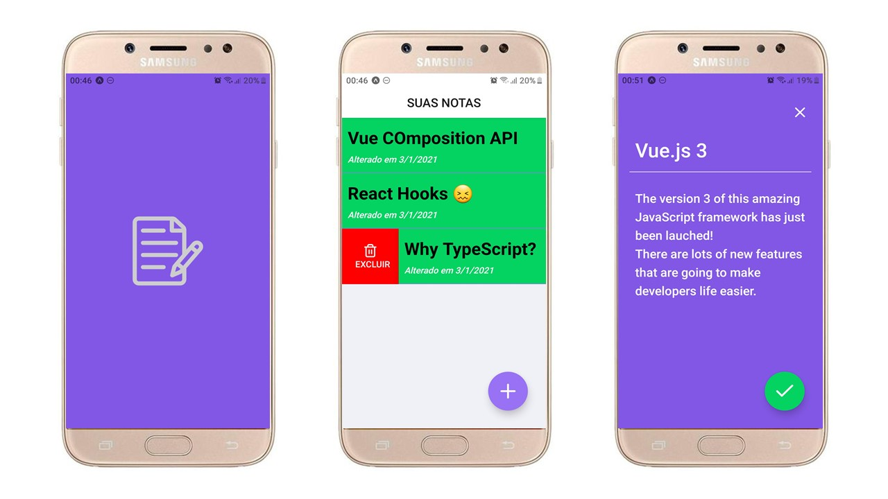

<h1 align="center">
  :books: Simple CRUD with React Native
</h1>

<p align="center">
  <a href="#trophy-lessons-learned">Lessons Learned</a>&nbsp;&nbsp;&nbsp;|&nbsp;&nbsp;&nbsp;
  <a href="#rocket-technologies--resources">Technologies</a>&nbsp;&nbsp;&nbsp;|&nbsp;&nbsp;&nbsp;
  <a href="#hammer-setting-up-the-environment">Environment Setup</a>&nbsp;&nbsp;&nbsp;|&nbsp;&nbsp;&nbsp;
  <a href="#zap-features">Features</a>
</p>

<p align="center">
  

  

  

  

  
</p>



Application developed as an assignment to college, subject Development for Mobile Devices, at UFPR, in order to learn building **React Native** applications. The project seeks to apply knowledge in functional components, screens navigation, Context API and reducers; This application is fully offline (no external data fetching).

The intent was to create a simple notes application with CRUD operations (create, read, update & delete) to explore the React API in mobile devices environment. We should have a screen to display a list of existing notes, feature to delete notes and features to see/edit new or existing notes in another screen. The state should be managed by **React Context API** and changes dispatched to a reducer.

## :trophy: Lessons Learned

- Build a swipeable component;
- React Native Navigation (stack mode);
- React Context API (including `useContext` hook);
- `useReducer` hooks to dispatch actions;
- Babel plugin `jsx-control-statements`!!! AWESOME 😍

## :rocket: Technologies & Resources

**Frontend:**
- React Native
- Expo Framework

**Development:**
- Visual Studio Code
- NPM routines

## :hammer: Setting up the Environment

Make sure to have **Node.js 10+** installed in your machine and its **npm** available in the command line, then use the following routines:

```bash
$ npm install   # download all dependencies
$ npm start     # run development server
```

## :zap: Features

- [x] List all existing notes;
- [x] Delete a note by swiping left/right;
- [x] Create new note with title and body; and
- [x] Editing existing note.
